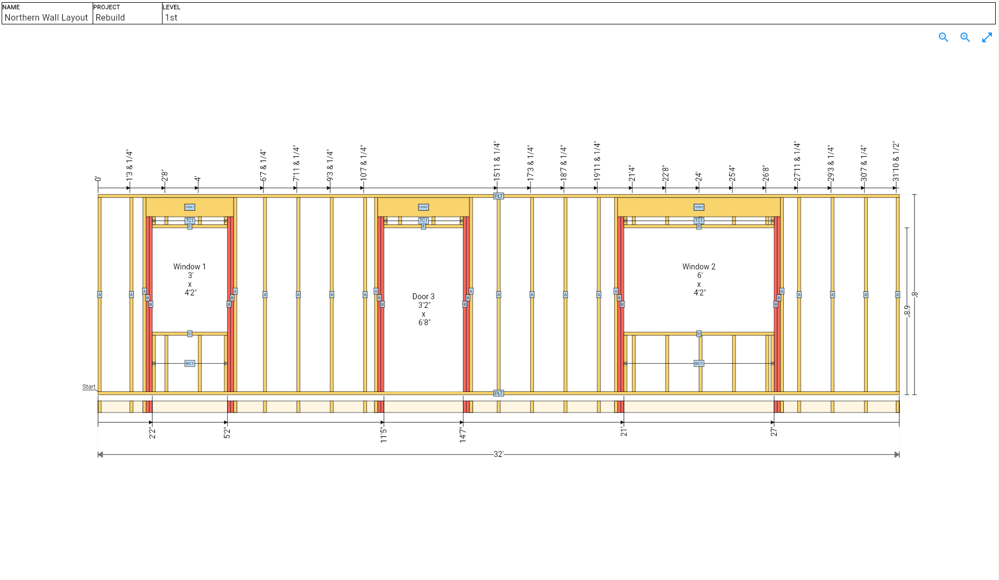

## Introduction

The outline of how fixing a sagging floor turned into rebuilding front portion of a house.
Keep in mind I am not a builder/contractor, by profession I am a software engineer.

The property started off as a single bedroom, and was later extended to 3 bedrooms 2 baths.
The original part of the property has been the cause of all issues, and is where all of the below outlined work took place.

## The Problems
<ul class="tree">
  <li>
<strong>Floor Joists</strong>

  * Termites
  * Rot
  * Fallen Joists
  </li>
</ul>

<ul class="tree">
  <li>
<strong>Wall</strong>

  * Termites
  * Rot
  * Sagging
  * Uninsulated
  </li>
</ul>

<ul class="tree">
  <li>
<strong>Foundation</strong>

  * Termites
  * Rot
  * Moisture
  * Block/Beam (Heavy Sagging, No actual footing)

  </li>
</ul>

<ul class="tree">
  <li>
<strong>Brick Facade</strong>

  * Unsecured
  * Unlevel
  * No footer

  </li>
</ul>

## Todo List

<table>
<thead>
  <tr>
    <th class="width-min">Task</th>
    <th class="width-auto">Description</th>
  </tr>
</thead>
<tbody>
  <tr>
    <td>Rebuild flooring system</td>
  </tr>
</tbody>
</table>

## Entry

